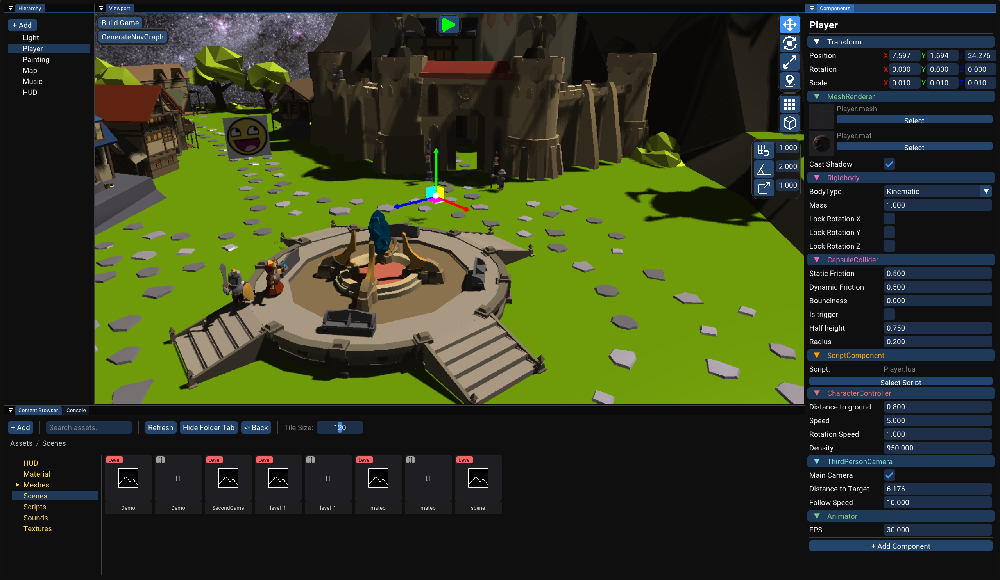
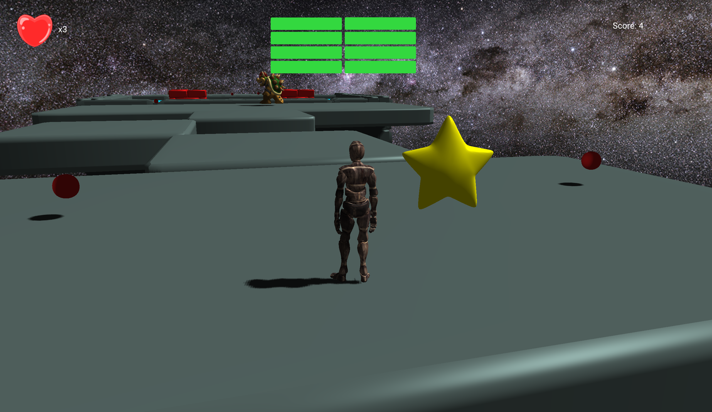

# Apex Engine

A custom 3D game engine built from scratch in C++, developed as our 2nd-year end-of-year project over 4–5 months by a team of 4 programmers.

---

## Table of Contents

- [Overview](#overview)
- [Screenshots](#screenshots)
- [Games Built With the Engine](#games-built-with-the-engine)
- [Core Features (3D Platformer)](#core-features-3d-platformer)
- [Gameplay & Engine Bonus Features](#gameplay--engine-bonus-features)
- [The Editor](#the-editor)
- [My Contributions](#my-contributions)
- [Tech Stack](#tech-stack)
- [Custom Libraries](#custom-libraries)
- [Build](#build)

---

## Overview

Apex Engine is a 3D engine geared toward puzzle-platformer gameplay, written in C++ with OpenGL for rendering. It was built to be generic enough to support more than one game - we validated this by shipping two very different prototypes with it.

Built in 4–5 months as a 2nd-year end-of-year project, with bi-weekly teacher reviews and peer code review on every merge to `master`.

## Screenshots

*Editor overview*


*Build platformer overview*


## Games Built With the Engine

**3D Platformer** (Mario-inspired)
A third-person puzzle-platformer where the player navigates a level full of obstacles, collects items to raise their score, and must reach the end of the level without running out of hit points.

**"Pokémon-like"**
A minimal monster-battling prototype: random encounters while walking through grass, and turn-based battles with just Attack/Flee options.

## Core Features (3D Platformer)

- **Player character** with animations
- **Controls:** WASD / ZQSD movement, Space to jump, Q/A to shoot
- **Physical interactions:** the player can shoot a ball-projectile to damage some enemies
- **3D environments** containing obstacles and puzzles
- **Win condition:** reach the end of the level
- **Lose condition:** run out of hit points
- **HUD:** hit points + score
- **Menu:** restart/quit, accessible anytime via Esc, also shown on win/lose end screens
- **Audio:** SFX for shooting, jumping, taking damage, winning/losing, and item pickups, plus background music
- **Scoring:** score increases by picking up items scattered across the map

## The Editor

Alongside the runtime, the project includes a full editor used to build and test levels:

- **Hierarchy** - tree view of all GameObjects in the current scene
- **Inspector** - view and edit the properties/components of the selected GameObject
- **Content Browser** - browse and manage the project's assets
- **Viewport** - the 3D scene view, which also allows to run the game directly inside the editor
- **Console** - prints both engine and game logs in real time; logs are also written out to a file
- **Resource Visualizer** - lets you preview meshes, view textures, and play sounds directly in the editor

## My Contributions

The following list highlights some of my main contributions.

- **Cascaded Shadow Mapping** - implemented the shadow mapping system, including cascade splitting for better shadow resolution across view distances
- **Pathfinding** - a navigation graph is generated in the editor and baked out to a binary file; at runtime, the engine loads that graph and runs A* on it to find the shortest path
- **LibMath** - wrote our custom math library (vectors, matrices, transforms) used throughout rendering, physics, and gameplay code; developed as a standalone school project across both 1st and 2nd year
- **Custom `.mesh` binary format** - designed a binary file format to store 3D models. When a model is first imported into the editor, it's converted and cached as a `.mesh` file, so only the lightweight custom format needs to be loaded afterward instead of re-parsing the original FBX
- Hand-written GLSL shaders (alongside the rest of the team) for lighting, shadows, and other rendering passes

## Tech Stack

Written in C++, built on top of the following libraries:

| Purpose | Library |
|---|---|
| Rendering API | [OpenGL](https://registry.khronos.org/OpenGL/) (loaded via [glad](https://glad.dav1d.de/)) |
| Windowing & Input | [GLFW](https://www.glfw.org/) |
| Engine/Debug GUI | [Dear ImGui](https://github.com/ocornut/imgui) |
| Physics | [NVIDIA PhysX](https://nvidiagameworks.github.io/simulation.html#physx) |
| Audio | [irrKlang](https://www.ambiera.com/irrklang/) |
| 3D Model Import | [Autodesk FBX SDK](https://help.autodesk.com/view/FBX/2020/ENU/?guid=FBX_API_Reference_cpp_ref_index_html) |
| Texture Loading | [stb_image](https://github.com/nothings/stb) |
| Scripting | [Lua](https://www.lua.org/) |
| Math | LibMath (custom, in-house) |

Shaders are hand-written GLSL.

Full rationale for each library choice and integration notes live in the [documentation](Documentation.md).

## Custom Libraries

- **LibMath** - our own math library (vectors, matrices, transforms, ...), also a standalone school project developed across 1st and 2nd year
- **Custom `.mesh` format** - binary format for storing imported models, generated automatically the first time a model is dropped into the editor

## Build

The project uses **CMake**.

This project links against the Autodesk FBX SDK, which is **not included** in this repository (its license doesn't permit redistribution, and the binaries are too large for git). You'll need to download and place it manually before building.

### 1. Download the SDK

Get the **FBX SDK 2020.3.7 (or compatible version), VS2022, x64** from Autodesk:
https://aps.autodesk.com/developer/overview/fbx-sdk

(Sign in with a free Autodesk account if prompted.)

### 2. Install it into the project

Run the installer, then copy the relevant folders into `External/FBX_SDK/` so the structure looks like this:

```bash
External/
└── FBX_SDK/
    ├── include/
    │   └── ... (fbxsdk.h, etc.)
    └── lib/
        └── x64/
            ├── debug/
            │   └── libfbxsdk.lib
            └── release/
                └── libfbxsdk.lib
```

> The default Autodesk installer usually installs to a path like
> `C:\Program Files\Autodesk\FBX\FBX SDK\2020.3.7\`.
> Copy the `include/` folder and the `lib/x64/debug/` and `lib/x64/release/` folders (each containing `libfbxsdk.lib`) from there into `External/FBX_SDK/` as shown above.

### 3. Build

Once the files are in place, CMake will pick them up automatically via:
```cmake
set(FBX_ROOT "${CMAKE_SOURCE_DIR}/External/FBX_SDK")
```
No further configuration is needed - just re-run CMake and build as usual.

### Notes
- The `debug` and `release` `.lib` files are different builds; make sure both are present if you plan to build in both configurations.
- The DLL (`libfbxsdk.dll`) may also be required at runtime - copy it next to your executable if you hit a missing-DLL error when running the built binary.

  
